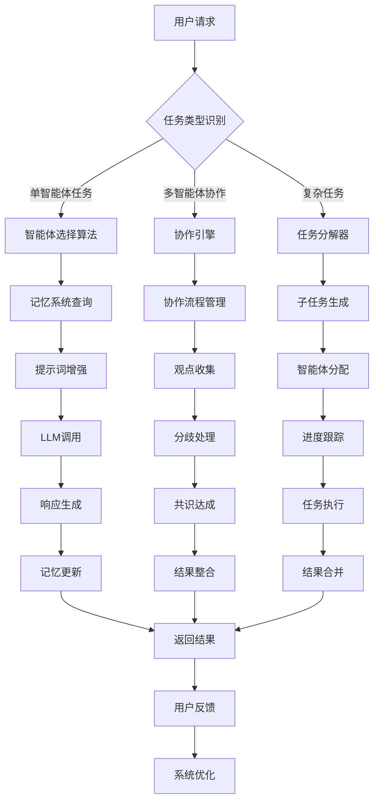
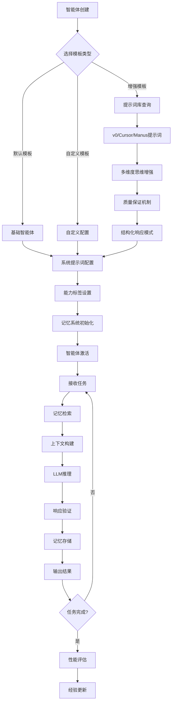
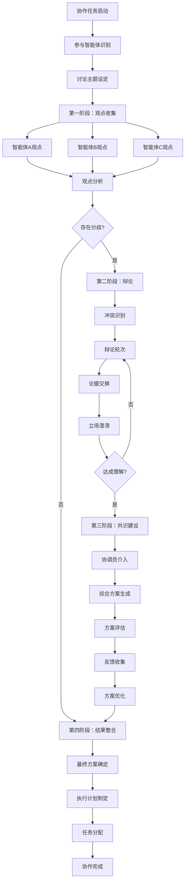
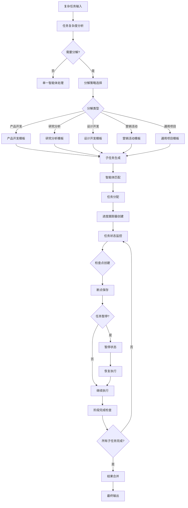
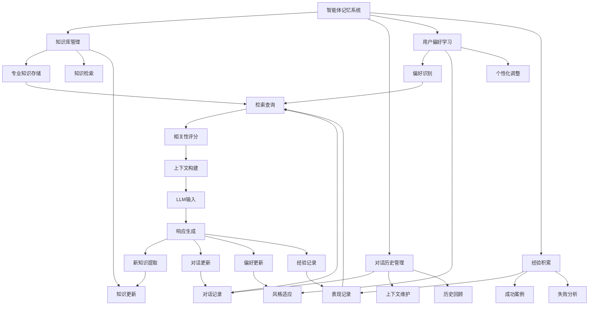
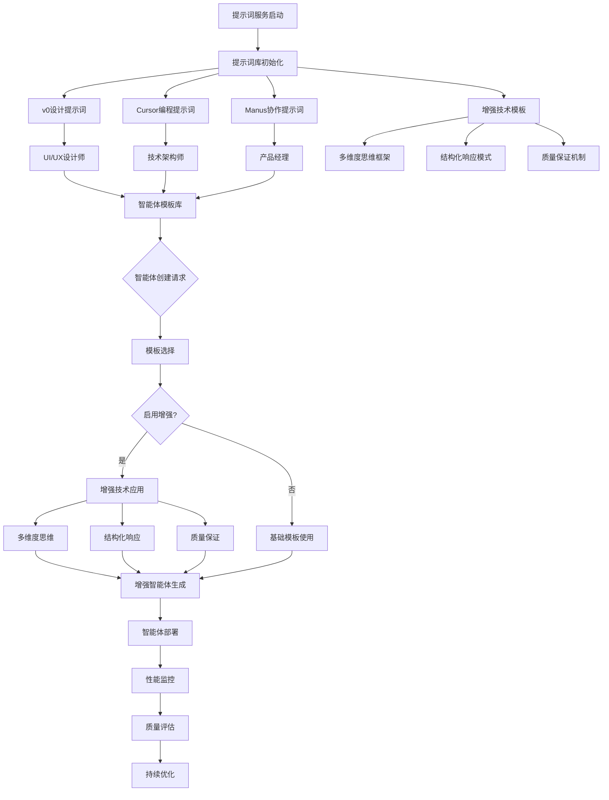
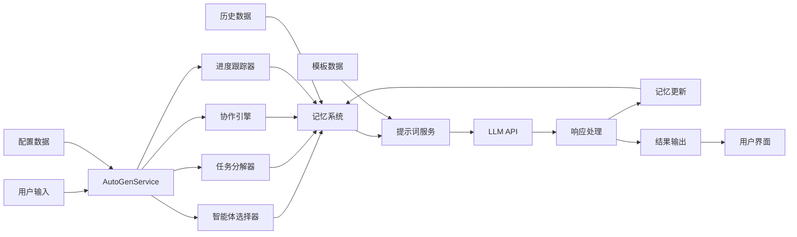
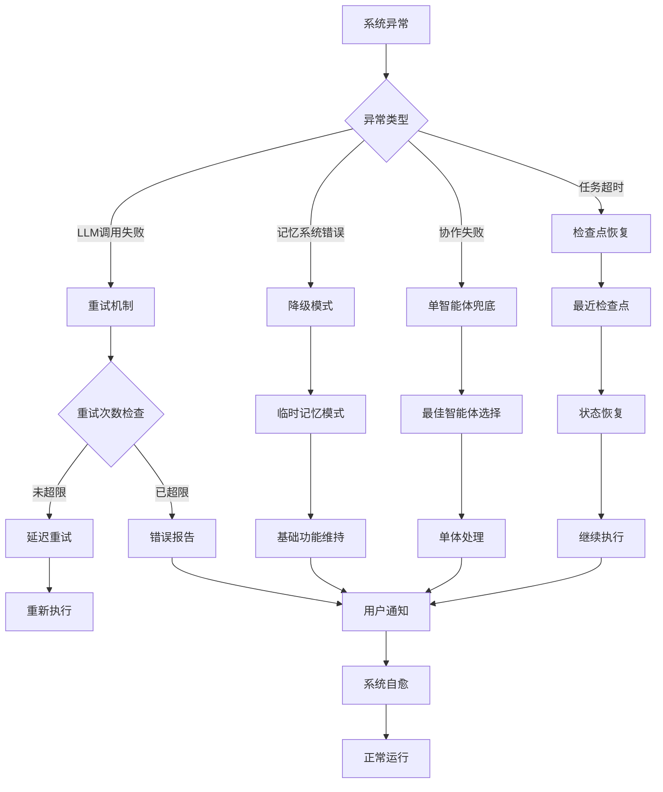
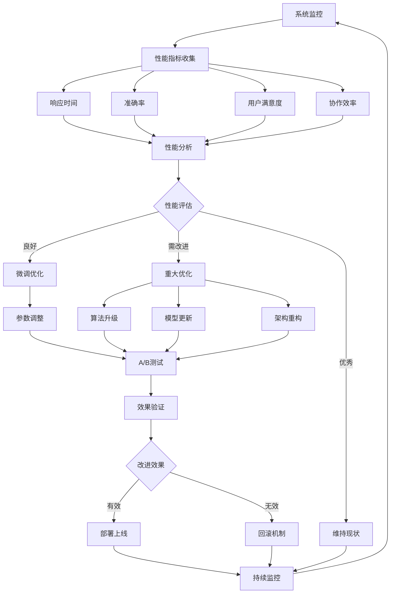

# AutoGen 多智能体系统流程图

## 系统总体架构流程图

```mermaid
graph TD
    A[用户请求] --> B{任务类型识别}
    B -->|单智能体任务| C[智能体选择算法]
    B -->|多智能体协作| D[协作引擎]
    B -->|复杂任务| E[任务分解器]
    
    C --> F[记忆系统查询]
    F --> G[提示词增强]
    G --> H[LLM调用]
    H --> I[响应生成]
    I --> J[记忆更新]
    J --> K[返回结果]
    
    D --> L[协作流程管理]
    L --> M[观点收集]
    M --> N[分歧处理]
    N --> O[共识达成]
    O --> P[结果整合]
    P --> K
    
    E --> Q[子任务生成]
    Q --> R[智能体分配]
    R --> S[进度跟踪]
    S --> T[任务执行]
    T --> U[结果合并]
    U --> K
    
    K --> V[用户反馈]
    V --> W[系统优化]
```

## 智能体生命周期流程图

```mermaid
graph TD
    A[智能体创建] --> B{选择模板类型}
    B -->|默认模板| C[基础智能体]
    B -->|增强模板| D[提示词库查询]
    B -->|自定义模板| E[自定义配置]
    
    D --> F[v0/Cursor/Manus提示词]
    F --> G[多维度思维增强]
    G --> H[质量保证机制]
    H --> I[结构化响应模式]
    
    C --> J[系统提示词配置]
    E --> J
    I --> J
    
    J --> K[能力标签设置]
    K --> L[记忆系统初始化]
    L --> M[智能体激活]
    
    M --> N[接收任务]
    N --> O[记忆检索]
    O --> P[上下文构建]
    P --> Q[LLM推理]
    Q --> R[响应验证]
    R --> S[记忆存储]
    S --> T[输出结果]
    
    T --> U{任务完成?}
    U -->|否| N
    U -->|是| V[性能评估]
    V --> W[经验更新]
```

## 协作引擎详细流程图

```mermaid
graph TD
    A[协作任务启动] --> B[参与智能体识别]
    B --> C[讨论主题设定]
    C --> D[第一阶段：观点收集]
    
    D --> E[智能体A观点]
    D --> F[智能体B观点]
    D --> G[智能体C观点]
    
    E --> H[观点分析]
    F --> H
    G --> H
    
    H --> I{存在分歧?}
    I -->|否| J[第四阶段：结果整合]
    I -->|是| K[第二阶段：辩论]
    
    K --> L[冲突识别]
    L --> M[辩论轮次]
    M --> N[论据交换]
    N --> O[立场澄清]
    O --> P{达成理解?}
    P -->|否| M
    P -->|是| Q[第三阶段：共识建设]
    
    Q --> R[协调员介入]
    R --> S[综合方案生成]
    S --> T[方案评估]
    T --> U[反馈收集]
    U --> V[方案优化]
    V --> J
    
    J --> W[最终方案确定]
    W --> X[执行计划制定]
    X --> Y[任务分配]
    Y --> Z[协作完成]
```

## 任务分解与进度跟踪流程图

```mermaid
graph TD
    A[复杂任务输入] --> B[任务复杂度分析]
    B --> C{需要分解?}
    C -->|否| D[单一智能体处理]
    C -->|是| E[分解策略选择]
    
    E --> F{分解类型}
    F -->|产品开发| G[产品开发模板]
    F -->|研究分析| H[研究分析模板]
    F -->|设计开发| I[设计开发模板]
    F -->|营销活动| J[营销活动模板]
    F -->|通用项目| K[通用项目模板]
    
    G --> L[子任务生成]
    H --> L
    I --> L
    J --> L
    K --> L
    
    L --> M[智能体匹配]
    M --> N[任务分配]
    N --> O[进度跟踪器创建]
    
    O --> P[任务状态监控]
    P --> Q{检查点创建}
    Q --> R[断点保存]
    R --> S{任务暂停?}
    S -->|是| T[暂停状态]
    S -->|否| U[继续执行]
    
    T --> V[恢复执行]
    V --> U
    U --> W[阶段完成检查]
    W --> X{所有子任务完成?}
    X -->|否| P
    X -->|是| Y[结果合并]
    Y --> Z[最终输出]
```

## 记忆系统运作流程图

```mermaid
graph TD
    A[智能体记忆系统] --> B[知识库管理]
    A --> C[对话历史管理]
    A --> D[用户偏好学习]
    A --> E[经验积累]
    
    B --> F[专业知识存储]
    B --> G[知识检索]
    B --> H[知识更新]
    
    C --> I[对话记录]
    C --> J[上下文维护]
    C --> K[历史回顾]
    
    D --> L[偏好识别]
    D --> M[风格适应]
    D --> N[个性化调整]
    
    E --> O[表现记录]
    E --> P[成功案例]
    E --> Q[失败分析]
    
    F --> R[检索查询]
    I --> R
    L --> R
    O --> R
    
    R --> S[相关性评分]
    S --> T[上下文构建]
    T --> U[LLM输入]
    U --> V[响应生成]
    
    V --> W[新知识提取]
    V --> X[对话更新]
    V --> Y[偏好更新]
    V --> Z[经验记录]
    
    W --> H
    X --> I
    Y --> M
    Z --> O
```

## 提示词服务集成流程图

```mermaid
graph TD
    A[提示词服务启动] --> B[提示词库初始化]
    B --> C[v0设计提示词]
    B --> D[Cursor编程提示词]
    B --> E[Manus协作提示词]
    B --> F[增强技术模板]
    
    C --> G[UI/UX设计师]
    D --> H[技术架构师]
    E --> I[产品经理]
    F --> J[多维度思维框架]
    F --> K[结构化响应模式]
    F --> L[质量保证机制]
    
    G --> M[智能体模板库]
    H --> M
    I --> M
    
    M --> N{智能体创建请求}
    N --> O[模板选择]
    O --> P{启用增强?}
    P -->|是| Q[增强技术应用]
    P -->|否| R[基础模板使用]
    
    Q --> S[多维度思维]
    Q --> T[结构化响应]
    Q --> U[质量保证]
    
    S --> V[增强智能体生成]
    T --> V
    U --> V
    R --> V
    
    V --> W[智能体部署]
    W --> X[性能监控]
    X --> Y[质量评估]
    Y --> Z[持续优化]
```

## 数据流向图

```mermaid
graph LR
    A[用户输入] --> B[AutoGenService]
    B --> C[智能体选择器]
    B --> D[任务分解器]
    B --> E[协作引擎]
    B --> F[进度跟踪器]
    
    C --> G[记忆系统]
    D --> G
    E --> G
    F --> G
    
    G --> H[提示词服务]
    H --> I[LLM API]
    I --> J[响应处理]
    
    J --> K[记忆更新]
    J --> L[结果输出]
    
    K --> G
    L --> M[用户界面]
    
    N[配置数据] --> B
    O[模板数据] --> H
    P[历史数据] --> G
```

## 错误处理与恢复流程图

```mermaid
graph TD
    A[系统异常] --> B{异常类型}
    B -->|LLM调用失败| C[重试机制]
    B -->|记忆系统错误| D[降级模式]
    B -->|协作失败| E[单智能体兜底]
    B -->|任务超时| F[检查点恢复]
    
    C --> G{重试次数检查}
    G -->|未超限| H[延迟重试]
    G -->|已超限| I[错误报告]
    
    D --> J[临时记忆模式]
    J --> K[基础功能维持]
    
    E --> L[最佳智能体选择]
    L --> M[单体处理]
    
    F --> N[最近检查点]
    N --> O[状态恢复]
    O --> P[继续执行]
    
    H --> Q[重新执行]
    I --> R[用户通知]
    K --> R
    M --> R
    P --> R
    
    R --> S[系统自愈]
    S --> T[正常运行]
```

## 系统监控与优化流程图

```mermaid
graph TD
    A[系统监控] --> B[性能指标收集]
    B --> C[响应时间]
    B --> D[准确率]
    B --> E[用户满意度]
    B --> F[协作效率]
    
    C --> G[性能分析]
    D --> G
    E --> G
    F --> G
    
    G --> H{性能评估}
    H -->|优秀| I[维持现状]
    H -->|良好| J[微调优化]
    H -->|需改进| K[重大优化]
    
    J --> L[参数调整]
    K --> M[算法升级]
    K --> N[模型更新]
    K --> O[架构重构]
    
    L --> P[A/B测试]
    M --> P
    N --> P
    O --> P
    
    P --> Q[效果验证]
    Q --> R{改进效果}
    R -->|有效| S[部署上线]
    R -->|无效| T[回滚机制]
    
    S --> U[持续监控]
    T --> U
    I --> U
    U --> A
```

